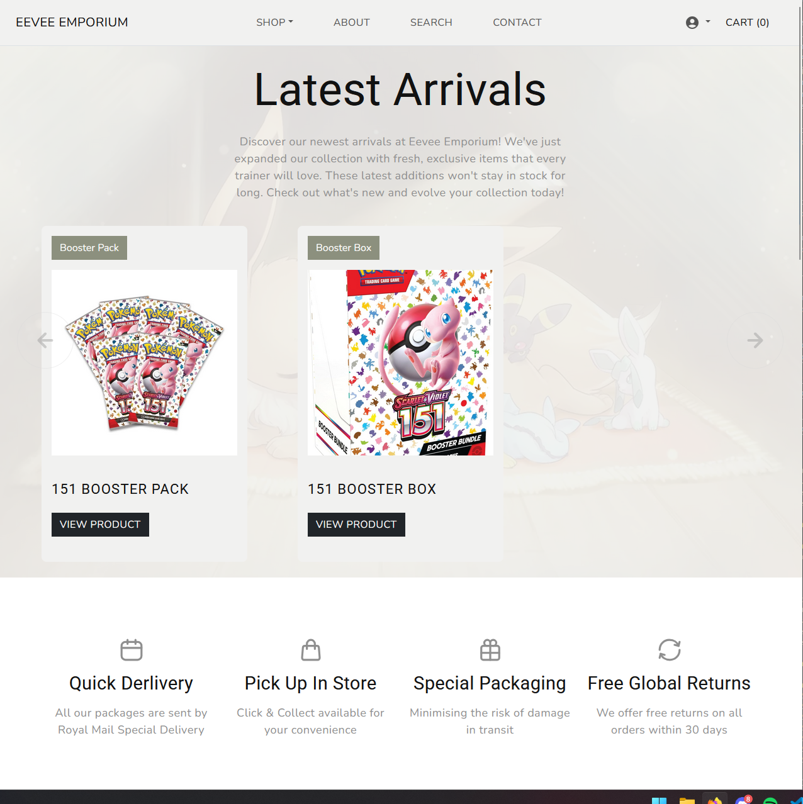

# Eevee Emporium

Eevee Emporium is my submission for the Code Institute Milestone 4 project. It is a full-stack e-commerce platform built using the Django framework, designed for Pokémon enthusiasts. The store allows users to browse, purchase, and manage orders for a variety of Pokémon-related items, including trading cards, accessories, and merchandise. The project leverages Django's robust back-end capabilities to handle product management, user authentication, and a secure checkout process. A key architectural decision was to utilize Django's built-in authentication system to provide a secure and streamlined user experience, focusing on core functionalities without the need for external packages.



View the Website [Here.](https://eeveeemporium-a0b363641244.herokuapp.com/)

## UX Developments

### Strategy

#### Project Goals

    Develop a full-stack e-commerce website with full CRUD functionality.
    Guests can browse products, view details, and add items to the cart.
    Users can create an account, log in, and manage their personal profile and order history.
    Registered users can complete a secure checkout process to purchase items.
    Admins have full CRUD functionality for products, categories, and can manage all user orders.
    The website will be fully responsive, providing a seamless experience on all device sizes.
    Implement robust error handling and user feedback to ensure a smooth user journey.
    Ensure a clear and intuitive user interface for easy navigation and product discovery.

#### User Demographic

    Pokémon fans and collectors of all ages.
    Individuals looking to purchase Pokémon trading cards, merchandise, and accessories.
    Gift shoppers looking for Pokémon-related items.
    Potential employers evaluating full-stack development skills.

### User Stories

#### First-Time Visitor / Guest Goals

As a first-time visitor, I want to be able to:

    Immediately understand the site is an e-commerce store for Pokémon products.
    Easily navigate the site and browse through different product categories.
    Search for specific products.
    View detailed information and images for each product.
    Add products to my shopping bag.
    Easily register for a new account.

#### Registered User Goals

As a registered user, I want to be able to:

    Securely log in and out of my account.
    View and update my personal information and shipping details.
    View my past order history.
    Proceed through a secure and simple checkout process to buy items in my bag.
    Receive an order confirmation after purchase.

#### Site Admin Goals

As a site admin, I want to be able to:

    Add new products to the store, including details like name, description, price, and image.
    Edit existing product information.
    Delete products from the store.
    View and manage all customer orders.
    Manage product categories to organize the storefront.

### Scope

#### Functionality Planning

When planning the scope of the project I created a Viability Analysis of the features I wished to add. This would allow me to prioritise the most critical features and defer the development of lesser functionality to a later date. Below is that table:

| #   | Feature                                | Importance | Viability |
| --- | -------------------------------------- | ---------- | --------- |
| 1   | Product CRUD Functionality (Admin)     | 5          | 5         |
| 2   | User Registration & Login              | 5          | 5         |
| 3   | Shopping Cart Functionality            | 5          | 5         |
| 4   | Secure Checkout with Stripe            | 5          | 5         |
| 5   | User Profile & Order History           | 4          | 5         |
| 6   | Product Search & Filtering             | 4          | 4         |
| 7   | Product Category Management (Admin)    | 4          | 5         |
| 8   | Responsive Design                      | 5          | 5         |
| 9   | User Action Validation & Feedback      | 5          | 5         |
| 10  | Product Reviews & Ratings              | 3          | 4         |
| 11  | Stock/Inventory Management             | 4          | 4         |
| 12  | Wishlist Functionality                 | 2          | 3         |
| 13  | Admin Dashboard for Order Management   | 5          | 5         |

Based on the premise of creating a minimally viable product I have decided to focus on implementing only the core functionality for the application to meet the minimum required specifications for functionality. This means on the initial development sprint I will be implementing features 1, 2, 3, 4, 7 and 13.

#### Functionality Requirements

- Clean and thematically cohesive design
- Functional and aesthetic presentation of Products
- Comprehensive inventory management to add, edit and delete items
- Login/logout functionality
- Manage profile
- Full CRUD functionality
- Defensive programming usage to safeguard the database from malicious or erroneous input
- Appropriate handling of error messages

# Structure

## Topology Diagrams

Below are diagrams illustrating the pages that are accessible for users based on their session state (guest/logged in guest/admin), any page not listed in a diagram is designed not to be accessible by a user.


install virtual environment:
```python -m venv virt```

Run Virtual Environment:
```./virt/Scripts/activate```

Install requirements:
```pip install -r requirements.txt```

Create superuser:
```python manage.py createsuperuser```

Follow prompts to add username, email and password.

Launch development server:
```python manage.py reunserver```


Template:
https://themewagon.com/themes/kaira/

Favicon:
https://commons.wikimedia.org/wiki/File:Pok%C3%A9_Ball_icon.svg

Favicon Generator
https://realfavicongenerator.net/

Wallpaper:
https://wall.alphacoders.com/big.php?i=613932

image optimiser:
https://squoosh.app

## Using Default Account Functionality over AllAuth

I opted not to use AllAuth in this project as Django comes with a robust and secure built-in authentication system (django.contrib.auth) that provides the fundamental building blocks for user management. For a project that requires standard user registration, login, logout, password reset, and profile updates, Django's default capabilities are often more than enough.

1 - Core User Model: Django provides a User model out of the box, which includes essential fields like username, password (hashed for security), email, first name, last name, is_active, is_staff, and is_superuser. This covers the basic identity and administrative roles.

2 - Authentication Views and URLs: Django includes pre-built views and URL patterns for common authentication actions:

- login/
- logout/
- password_change/
- password_change/done/
- password_reset/
- password_reset/done/
- reset/<uidb64>/<token>/
- reset/done/

By simply including django.contrib.auth.urls in our urls.py and creating custom templates for these views, we can get a fully functional authentication system with minimal effort.

3 - Extending the User Model (User Profile): For any additional user-specific information (e.g., a bio, profile picture, phone number), Django strongly recommends creating a separate "profile" model that has a OneToOneField relationship with the User model. This keeps authentication concerns separate from user data and allows for flexible extension without modifying Django's core User model directly. We can then easily create and update this profile information when users register or update their details. Signals (like post_save) can be used to automatically create a UserProfile whenever a new User is created.

4 - Forms for Registration and Updates: Django's UserCreationForm and UserChangeForm are excellent starting points for handling user registration and updates. These forms are based on the User model and can be easily customized or extended to include fields from our custom UserProfile model. This allows us to build our registration and profile update forms with Django's powerful form handling.

5 - Security: Django's built-in authentication system is designed with security in mind, handling password hashing, session management, and common vulnerabilities. By sticking to the default, we benefit from the continuous security improvements and best practices maintained by the Django community.

6 - Simplicity and Control: For projects with straightforward authentication requirements, using Django's defaults offers greater control and a simpler setup. We avoid introducing an external dependency, reducing potential complexity and the learning curve associated with a new library. We have direct control over the templates, views, and forms, allowing for precise customization.

## Why AllAuth is Unnecessary (for this project)

Django AllAuth is a fantastic and comprehensive package that offers a wide array of features, particularly for more complex authentication needs. However, for our project, these advanced features are currently not required, making AllAuth an unnecessary addition:

- Social Authentication (Google, Facebook, etc.): AllAuth excels at integrating with various social login providers. If our project required users to sign up or log in via Google, Facebook, Twitter, etc., AllAuth would be a strong contender. However, our current scope only requires traditional username/email and password authentication.
    
- Email Verification Workflows: While Django's default system can be extended for email verification, AllAuth provides robust, ready-to-use email verification workflows (mandatory, optional, none). Our current needs for email verification are basic and can be handled with simpler custom logic.
    
- Account Management Beyond Basic Updates: AllAuth includes more advanced account management features like linking/unlinking multiple email addresses, managing social account connections, etc. These features are not part of our initial requirements.
    
- Pre-built Templates and Views (Opinionated): AllAuth provides a set of pre-built templates and views that can accelerate development. However, these are often more opinionated in their structure and styling, and customizing them to fit a unique design can sometimes be more involved than building custom templates from scratch with Django's default views.
    
- Increased Dependency: Every third-party library adds a dependency to the project, which can introduce overhead in terms of maintenance, updates, and potential conflicts. By using Django's default, we keep our dependency footprint smaller.

In summary, for our Django project's user authentication and profile functionality, the built-in features of Django are perfectly capable and provide a secure, flexible, and maintainable solution without the added complexity of a larger third-party library like Django AllAuth. We can achieve all our requirements by extending and customizing Django's powerful default authentication system.